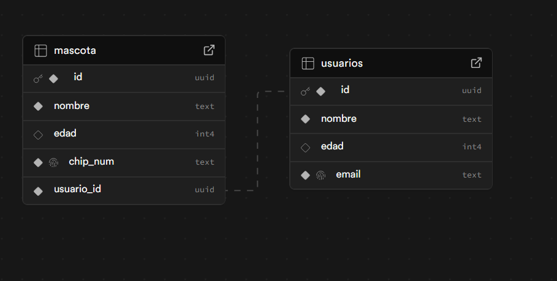
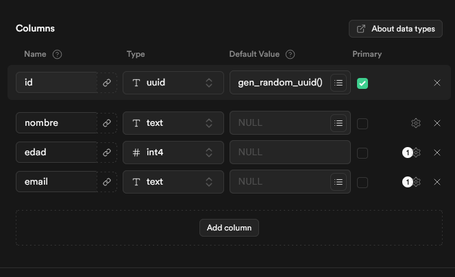
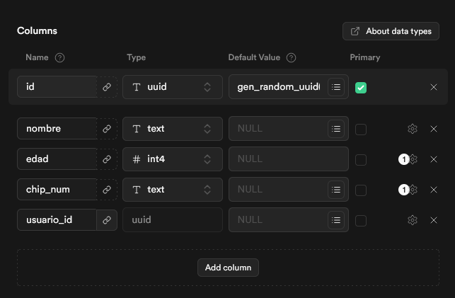
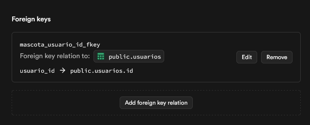

# Proyecto Supabase: Ironhack Modulo 3 Semana 1 Dia 2

Repositorio de ejemplo para crear dos tablas relacionadas en **Supabase**:

- `usuarios` (nombre, edad, email)
- `mascota` (nombre, edad, chip_num, usuario_id [FOREIGN KEY → usuarios.id])

## Esquema (resumen)

- **usuarios**

  - id `uuid` PK (auto)
  - nombre `text` NOT NULL
  - edad `int`
  - email `text` UNIQUE NOT NULL

- **mascota**
  - id `uuid` PK (auto)
  - nombre `text` NOT NULL
  - edad `int`
  - chip_num `text` UNIQUE NOT NULL
  - usuario_id `uuid` NOT NULL → FK a `usuarios(id)` (ON DELETE CASCADE)

---

## Capturas de pantalla

> Captura de **Table editor** mostrando las tablas creadas: [`screenshots/dashboard.png](screenshots/dashboard.png)

---

> Captura de estructura tabla usuarios: [`screenshots/usuarios_structure.png](screenshots/usuarios_structure.png)

---

> Captura de estructura tabla mascota: [`screenshots/mascota_structure.png](screenshots/mascota_structure.png)

---

> Captura de llaves foraneas (foreign keys) de mascota: [`screenshots/mascota_fks.png](screenshots/mascota_fks.png)

---

> Realizado por [@xarlizard](https://github.com/xarlizard)
